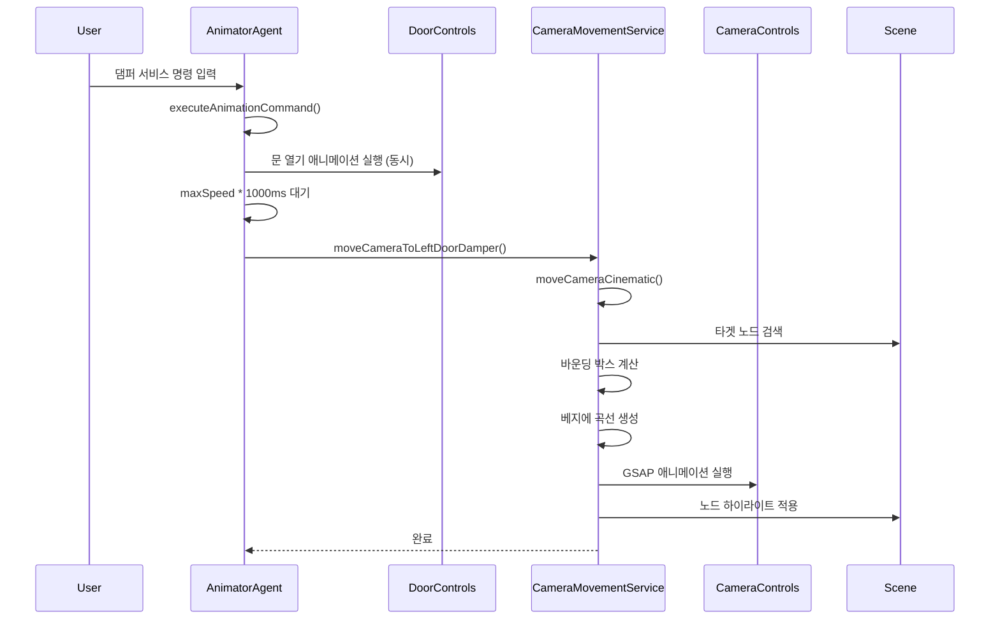
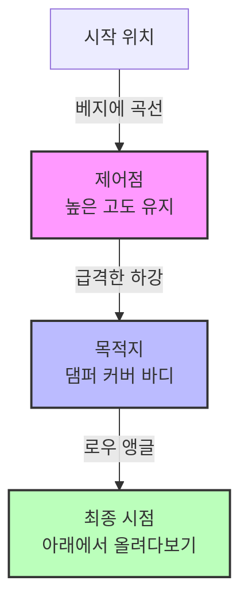

---
tags:
상태: Todo
중요:
생성일: 26-01-30T16:18:38
수정일: 26-01-30T16:27:06
종료일:
라벨:
  - Ref
  - 냉장고
---
## 0. 참고 레퍼런스
- 
##  ■■ Description ■■
- `AnimatorAgent.ts`에서 `await this.cameraMovementService.moveCameraToLeftDoorDamper();` 함수 호출 시, 
  왼쪽 도어 댐퍼 위치로 카메라를 이동시키는 방식과 동작 순서를 분석한 코드이다.
## 1. 호출 순서

## 2. 상세 동작 순서
### 2-1. 댐퍼 명령 감지 및 실행 (`AnimatorAgent.ts`)
| 단계  | 동작          | 코드 위치                                     |
| --- | ----------- | ----------------------------------------- |
| 1   | 사용자 입력 처리   | `processUserInput()`                      |
| 2   | 댐퍼 명령 감지    | `isFridgeDamperCommand(input)`            |
| 3   | 애니메이션 명령 생성 | `getFridgeDamperAnimationCommands(input)` |
| 4   | 명령 실행       | `executeAnimationCommand(commands)`       |
### 2-2. 문 열기 애니메이션 실행 (`AnimatorAgent.ts`)
```typescript
// 모든 댐퍼 명령을 동시에 실행
commandsArray.forEach(command => {
    const degrees = command.degrees || 90;
    const speed = command.speed || 1;

    if (command.action === AnimationAction.OPEN) {
        if (command.door === DoorType.TOP_LEFT) {
            this.doorControls.openByDegrees(degrees, speed, handleCompletion);
        } else if (command.door === DoorType.TOP_RIGHT) {
            this.doorControls.openRightByDegrees(degrees, speed, handleCompletion);
        }
        // ... 기타 도어 처리
    }
});
```
### 2-3. 애니메이션 완료 대기 (`AnimatorAgent.ts`)
```typescript
// 가장 긴 애니메이션이 완료될 때까지 대기
const maxSpeed = Math.max(...commandsArray.map(cmd => cmd.speed || 1));
await new Promise(resolve => setTimeout(resolve, maxSpeed * 1000));
```
### 2-4. 카메라 이동 호출 (`AnimatorAgent.ts`)
```typescript
// 댐퍼 애니메이션 완료 후 카메라 이동
if (this.cameraMovementService) {
    await this.cameraMovementService.moveCameraToLeftDoorDamper();

    // 카메라 이동 히스토리 기록
    const cameraMoveCommand: AnimationCommand = {
        door: DoorType.TOP_LEFT,
        action: AnimationAction.CAMERA_MOVE,
        degrees: 0,
        speed: 1
    };
    // ...
}
```
## 3. 카메라 이동 방식 (`CameraMovementService.ts`)
### 3-1. `moveCameraToLeftDoorDamper()` 메서드
```typescript
public async moveCameraToLeftDoorDamper(options: CameraMoveOptions = {}): Promise<void> {
    const upwardDirection = new THREE.Vector3(0, -1, 0).normalize();

    return this.moveCameraCinematic(LEFT_DOOR_NODES[0], {
        duration: options.duration || 1000,
        direction: options.direction || upwardDirection,
        zoomRatio: options.zoomRatio || 3,
        easing: options.easing || 'power3.inOut',
        ...options
    });
}
```
**주요 파라미터:**
- `targetNode`: `LEFT_DOOR_NODES[0]` = `"MCK71751101_Cover,Body_3117001"` (댐퍼 커버 바디)
- `duration`: 1000ms (기본값)
- `direction`: `(0, -1, 0)` - 아래쪽 방향
- `zoomRatio`: 3 - 3배 줌
- `easing`: `power3.inOut`
### 3-2 `moveCameraCinematic()` 메서드 상세 분석
### 3-2-1 초기화 단계
| 단계  | 동작        | 설명                                  |
| --- | --------- | ----------------------------------- |
| 1   | 타겟 노드 검색  | `getNodeByName(nodeName)`           |
| 2   | 카메라 확인    | `cameraControls.camera`             |
| 3   | 바운딩 박스 계산 | `getPreciseBoundingBox(targetNode)` |
| 4   | 중심점 추출    | `targetBox.getCenter(targetCenter)` |
| 5   | 크기 계산     | `targetBox.getSize(size)`           |
```typescript
const targetBox = getPreciseBoundingBox(targetNode);
const targetCenter = new THREE.Vector3();
targetBox.getCenter(targetCenter);
const size = new THREE.Vector3();
targetBox.getSize(size);
```
### 3-2-2 거리 및 목적지 계산
| 단계  | 동작       | 설명                                                |
| --- | -------- | ------------------------------------------------- |
| 1   | 시작 위치 저장 | `camera.position.clone()`                         |
| 2   | 시작 타겟 저장 | `cameraControls.target.clone()`                   |
| 3   | FOV 계산   | `(camera.fov * Math.PI) / 180`                    |
| 4   | 최대 차원 계산 | `Math.max(size.x, size.y, size.z)`                |
| 5   | 줌 거리 계산  | `(maxDim / 2) / Math.tan(fovRad / 2) * zoomRatio` |
| 6   | 방향 설정    | `(0, -1, 0)` 또는 `(0.5, -1, 0.5)`                  |
| 7   | 목적지 계산   | `targetCenter + direction * zoomDistance`         |

```typescript
const fovRad = (camera.fov * Math.PI) / 180;
const maxDim = Math.max(size.x, size.y, size.z);
const zoomDistance = (maxDim / 2) / Math.tan(fovRad / 2) * (options.zoomRatio || 1.2);

let direction = options.direction || new THREE.Vector3(0, -1, 0);

// 댐퍼 커버 바디 노드에 대해 일관된 뷰 제공
const damperCoverBodyNode = this.nodeNameManager.getNodeName('fridge.leftDoor.damperCoverBody');
if (nodeName === damperCoverBodyNode && !options.direction) {
    direction = new THREE.Vector3(0.5, -1, 0.5).normalize();
}

const endPos = targetCenter.clone().add(direction.clone().multiplyScalar(zoomDistance));
```
### 3-2-3 베지에 곡선 생성
```typescript
// 제어점 계산 (L자형 곡선)
const controlPos = new THREE.Vector3(
    (startPos.x + endPos.x) / 2,
    Math.max(startPos.y, endPos.y) + Math.max(size.y, maxDim) * 0.3,
    (startPos.z + endPos.z) / 2
);

// 베지에 곡선 생성
const cinematicCurve = new THREE.QuadraticBezierCurve3(
    startPos.clone(),
    controlPos,
    endPos.clone()
);
```
**곡선 특징:**
- **2차 베지에 곡선** 사용
- 제어점이 시작점과 끝점의 중간 X, Z 좌표에 위치
- 제어점의 Y 좌표는 시작점과 끝점 중 더 높은 값 + `maxDim * 0.3`
- 결과: **직선 접근 → 급격한 하강(Drop) → 로우 앵글(Low Angle)** 궤적
### 3-2-4 Damping 비활성화
```typescript
// Damping 비활성화 (카메라 컨트롤러의 자체 보간 방지)
const originalDamping = this.cameraControls.enableDamping;
const originalSmoothTime = this.cameraControls.smoothTime;
this.cameraControls.enableDamping = false;
this.cameraControls.smoothTime = 0;

// UP 벡터 리셋
camera.up.set(0, 1, 0);
```
**이유:** 카메라 컨트롤러의 자체 보간(Damping)이 베지에 곡선 궤적을 방해하는 것을 방지
### 3-2-5. GSAP 애니메이션 실행
```typescript
const duration = (options.duration || 2500) / 1000;
const easing = options.easing || 'power3.inOut';

await new Promise<void>((resolve) => {
    const animObj = { progress: 0 };

    gsap.to(animObj, {
        progress: 1,
        duration,
        ease: easing,
        onUpdate: () => {
            const smoothProgress = animObj.progress;

            // 1. 곡선에서 위치 가져오기
            const point = cinematicCurve.getPoint(smoothProgress);
            camera.position.copy(point);

            // 2. UP 벡터 점진적 전환 (로우 앵글 효과)
            if (options.direction && Math.abs(options.direction.y) > 0.8) {
                const lookDir = new THREE.Vector3()
                    .subVectors(targetCenter, camera.position)
                    .normalize();

                // 노드Y × 시선방향 (Cross Product)
                let calculatedUp = new THREE.Vector3()
                    .crossVectors(nodeY, lookDir)
                    .normalize();

                // 아래를 향하면 반전
                if (calculatedUp.y < 0) {
                    calculatedUp.negate();
                }

                // 점진적 UP 전환 (Cubic ease-out)
                const easeTransition = 1 - Math.pow(1 - smoothProgress, 3);
                const finalUp = new THREE.Vector3(0, 1, 0).lerp(calculatedUp, easeTransition);
                camera.up.copy(finalUp);
            } else {
                camera.up.set(0, 1, 0);
            }

            // 3. 타겟 lerp
            this.cameraControls.target.lerpVectors(startTarget, targetCenter, smoothProgress);
            this.cameraControls.update();

            options.onProgress?.(smoothProgress);
        },
        onComplete: () => {
            // 최종 상태 확정
            // Damping 복원
            // 노드 하이라이트 적용
            resolve();
        }
    });
});
```

| 특징       | 설명                                  |
| -------- | ----------------------------------- |
| 라이브러리    | GSAP (GreenSock Animation Platform) |
| 이징       | `power3.inOut` (기본값)                |
| 지속 시간    | 1초 (기본값)                            |
| 위치 업데이트  | 베지에 곡선에서 샘플링                        |
| UP 벡터 전환 | Cubic ease-out으로 점진적 전환             |
| 타겟 업데이트  | 선형 보간 (lerp)                        |
### 3-2-6 노드 하이라이트 적용
```typescript
// 카메라 이동 완료 후 노드 하이라이트 (Emissive 방식)
const nodeColors = [
    0x325311, // 녹색 (Cover Body)
    0xff3333, // 빨간색 (Damper Assembly)
    0x3333ff, // 파란색 (Screw 1)
    0xffff33  // 노란색 (Screw 2)
];

LEFT_DOOR_NODES.forEach((nodeName, index) => {
    if (index > 1) return; // 0번째, 1번째 인덱스만 색상 적용

    const node = this.getNodeByName(nodeName);
    if (node) {
        node.traverse((child) => {
            if (child instanceof THREE.Mesh) {
                if (Array.isArray(child.material)) {
                    child.material = child.material.map(mat => {
                        const newMat = mat.clone();
                        this.applyEmissive(newMat, nodeColors[index]);
                        return newMat;
                    });
                } else {
                    child.material = child.material.clone();
                    this.applyEmissive(child.material, nodeColors[index]);
                }
            }
        });
    }
});
```
**하이라이트 대상 노드:**

| 인덱스 | 노드 이름                               | 색상             | 설명         |
| --- | ----------------------------------- | -------------- | ---------- |
| 0   | `MCK71751101_Cover,Body_3117001`    | 녹색 (0x325311)  | 댐퍼 커버 바디   |
| 1   | `ACV74674704_Damper_Assembly_13473` | 빨간색 (0xff3333) | 댐퍼 어셈블리    |
| 2   | `4J01424B_Screw,Customized_4168029` | 파란색 (0x3333ff) | 나사 1 (미적용) |
| 3   | `4J01424B_Screw,Customized_4168028` | 노란색 (0xffff33) | 나사 2 (미적용) |
**Emissive 효과:**
```typescript
private applyEmissive(material: THREE.Material, color: number) {
    if ('emissive' in material) {
        (material as any).emissive.setHex(color);
        (material as any).emissiveIntensity = 0.8;
        material.needsUpdate = true;
    }
}
```
## 4. 카메라 이동 궤적 시각화



**궤적 특징:**
1. **직선 접근**: 시작점에서 제어점까지 직선으로 접근
2. **급격한 하강(Drop)**: 제어점에서 목적지로 급격히 하강
3. **로우 앵글(Low Angle)**: 목적지에 도달하여 아래에서 올려다보는 시점
## 5. 기술적 특징 요약
### 5-1 카메라 이동 방식
| 특징          | 설명                                  |
| ----------- | ----------------------------------- |
| 곡선 타입       | 2차 베지에 곡선 (QuadraticBezierCurve3)   |
| 애니메이션 라이브러리 | GSAP (GreenSock Animation Platform) |
| 이징 함수       | `power3.inOut` (기본값)                |
| 지속 시간       | 1000ms (기본값)                        |
| 줌 비율        | 3배 (기본값)                            |
| 방향 벡터       | `(0, -1, 0)` 또는 `(0.5, -1, 0.5)`    |
### 5-2 시네마틱 효과
| 효과      | 구현 방식                           |
| ------- | ------------------------------- |
| 직선 접근   | 베지에 곡선의 시작점에서 제어점까지             |
| 급격한 하강  | 제어점의 높은 Y 좌표에서 목적지로             |
| 로우 앵글   | UP 벡터를 점진적으로 전환하여 아래에서 올려다보는 효과 |
| 부드러운 이동 | GSAP의 `power3.inOut` 이징 적용      |
### 5-3 Damping 처리
| 단계       | 동작              | 이유                       |
| -------- | --------------- | ------------------------ |
| 애니메이션 시작 | Damping 비활성화    | 카메라 컨트롤러의 자체 보간 방지       |
| 애니메이션 중  | Damping 유지 비활성화 | 베지에 곡선 궤적 유지             |
| 애니메이션 완료 | Damping 복원      | 사용자 인터랙션을 위한 부드러운 컨트롤 복원 |
## 6. 관련 상수 정의
### 6.1 `LEFT_DOOR_NODES` (`fridgeConstants.ts`)
```typescript
export const LEFT_DOOR_NODES = [
    "MCK71751101_Cover,Body_3117001",      // 댐퍼 커버 바디
    "ACV74674704_Damper_Assembly_13473",   // 댐퍼 어셈블리
    "4J01424B_Screw,Customized_4168029",    // 나사 1
    "4J01424B_Screw,Customized_4168028"     // 나사 2
];
```
### 6.2 카메라 이동 옵션 (`CameraMoveOptions`)
```typescript
export interface CameraMoveOptions {
    duration?: number;           // milliseconds
    zoomRatio?: number;          // Custom zoom ratio
    direction?: THREE.Vector3;   // Custom camera direction
    easing?: string;             // GSAP easing name
    onProgress?: (progress: number) => void;
}
```
