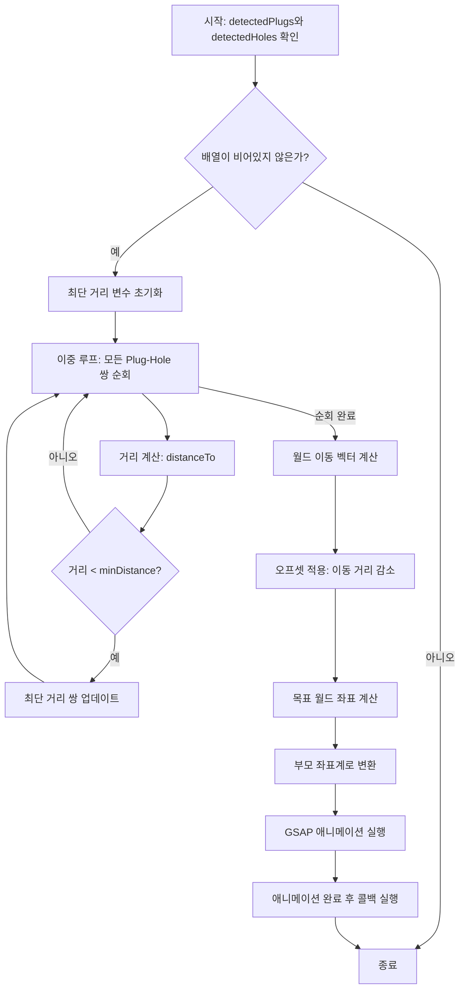

# 댐퍼 커버 조립 로직 분석 (라인 123-181)

## 개요

`DamperCoverAssemblyService.ts`의 123-181 라인은 **탐지된 돌출부(Plug)와 홈(Hole) 좌표 정보를 사용하여 댐퍼 커버 노드를 홈 노드로 결합하는 핵심 조립 로직**을 담당합니다.

---

## 사용된 방식들

### 1. 최근접 쌍 매칭 방식 (Nearest Neighbor Matching)
- **목적**: 여러 개의 돌출부와 홈 중에서 가장 가까운 쌍을 찾아 정확한 조립 위치 결정
- **알고리즘**: 이중 루프를 통한 전수 조사 (Brute-force Search)
- **거리 계산**: [`THREE.Vector3.distanceTo()`](src/services/fridge/DamperCoverAssemblyService.ts:132)

### 2. 월드 좌표계 기반 벡터 계산
- **월드 이동 벡터**: [`subVectors()`](src/services/fridge/DamperCoverAssemblyService.ts:144)를 사용하여 플러그에서 홈으로 향하는 방향 벡터 계산
- **좌표계 변환**: [`worldToLocal()`](src/services/fridge/DamperCoverAssemblyService.ts:163)을 사용하여 부모 좌표계 기준 로컬 위치로 변환

### 3. 오프셋 기반 미세 조정
- **목적**: 완전히 끼워지는 것을 방지하거나 삽입 깊이 조절
- **방식**: 이동 거리에서 0.0005 단위의 오프셋을 감소시킴
- **계산**: [`normalize().multiplyScalar(reducedDistance)`](src/services/fridge/DamperCoverAssemblyService.ts:153)

### 4. GSAP 애니메이션 (Tweening)
- **라이브러리**: GSAP (GreenSock Animation Platform)
- **이징 함수**: `power2.inOut` - 시작과 끝에서 부드러운 가속/감속
- **대상**: [`coverNode.position`](src/services/fridge/DamperCoverAssemblyService.ts:168)

---

## 동작 순서



### 단계별 상세 설명

| 순서 | 단계 | 코드 라인 | 설명 |
|------|------|-----------|------|
| 1 | 조건 확인 | 124 | `detectedPlugs`와 `detectedHoles`가 모두 존재하는지 확인 |
| 2 | 변수 초기화 | 125-127 | 최단 거리(`minDistance`), 최적 Plug/Hole 변수 초기화 |
| 3 | 최단 거리 쌍 탐색 | 130-138 | 이중 루프로 모든 쌍의 거리를 계산하여 최소값 찾기 |
| 4 | 로그 출력 | 141 | 발견된 최단 거리 쌍 정보를 콘솔에 출력 |
| 5 | 이동 벡터 계산 | 144 | `subVectors()`로 플러그→홈 방향의 월드 이동 벡터 계산 |
| 6 | 오프셋 적용 | 146-154 | 0.0005 오프셋을 적용하여 실제 이동 거리 감소 |
| 7 | 목표 좌표 계산 | 156-159 | 현재 위치 + 이동 벡터로 목표 월드 좌표 계산 |
| 8 | 좌표계 변환 | 161-164 | `worldToLocal()`로 부모 기준 로컬 좌표로 변환 |
| 9 | 애니메이션 실행 | 166-180 | GSAP로 `power2.inOut` 이징과 함께 선형 이동 실행 |

---

## 핵심 코드 분석

### 최단 거리 쌍 찾기 (라인 129-139)
```typescript
for (const plug of this.detectedPlugs) {
    for (const hole of this.detectedHoles) {
        const dist = plug.position.distanceTo(hole.position);
        if (dist < minDistance) {
            minDistance = dist;
            bestPlug = plug;
            bestHole = hole;
        }
    }
}
```
- 시간 복잡도: O(n×m) (n: 플러그 수, m: 홈 수)
- 각 쌍의 유클리드 거리를 계산하여 최소값을 가진 쌍을 선택

### 오프셋 계산 (라인 146-154)
```typescript
const offsetDistance = 0.0005;
const totalDistance = worldMoveVector.length();
const reducedDistance = Math.max(0, totalDistance - offsetDistance);

if (totalDistance > 0) {
    worldMoveVector.normalize().multiplyScalar(reducedDistance);
}
```
- 완전한 삽입을 방지하거나 정확한 위치에 멈추기 위한 미세 조정
- 벡터 정규화 후 감소된 거리만큼만 스케일 적용

### 좌표계 변환 (라인 161-164)
```typescript
const targetLocalPos = coverNode.parent
    ? coverNode.parent.worldToLocal(targetWorldPos.clone())
    : targetWorldPos;
```
- Three.js의 위계 구조(Hierarchy)를 고려한 좌표 변환
- 부모가 존재할 경우 로컬 좌표계로 변환, 없으면 월드 좌표 그대로 사용

### GSAP 애니메이션 (라인 166-180)
```typescript
gsap.to(coverNode.position, {
    x: targetLocalPos.x,
    y: targetLocalPos.y,
    z: targetLocalPos.z,
    duration: options?.duration ? options.duration / 1000 : 1.5,
    ease: 'power2.inOut',
    onComplete: () => {
        console.log('[조립] 커버 이동 완료');
        if (options?.onComplete) options.onComplete();
        resolve();
    }
});
```
- Promise 기반 비동기 처리로 애니메이션 완료 대기
- `power2.inOut` 이징으로 자연스러운 가속/감속 효과

---

## 사용된 데이터 구조

### detectedPlugs
```typescript
Array<{
    position: THREE.Vector3;          // 월드 좌표 위치
    rotationAxis: THREE.Vector3;     // 회전 축
    insertionDirection: THREE.Vector3; // 삽입 방향
    filteredVerticesCount: number;   // 필터링된 정점 수
}>
```

### detectedHoles
```typescript
Array<{
    position: THREE.Vector3;          // 월드 좌표 위치
    rotationAxis?: THREE.Vector3;    // 회전 축 (선택적)
    insertionDirection?: THREE.Vector3; // 삽입 방향 (선택적)
    filteredVerticesCount?: number;  // 필터링된 정점 수 (선택적)
}>
```

---

## 참고 사항

1. **좌표계 일관성**: 모든 위치 정보는 월드 좌표계 기준으로 통일되어 있으며, 애니메이션 적용 시에만 로컬 좌표계로 변환됨

2. **오프셋 값**: 0.0005는 실제 모델링 스케일에 따른 상대적 값이며, 필요 시 메타데이터로 외부화 가능

3. **에러 처리**: 빈 배열에 대한 처리는 라인 124의 조걸문에서 선제적으로 차단됨

4. **성능 고려**: 플러그와 홈의 수가 많아질 경우 O(n×m) 복잡도를 고려한 최적화가 필요할 수 있음
