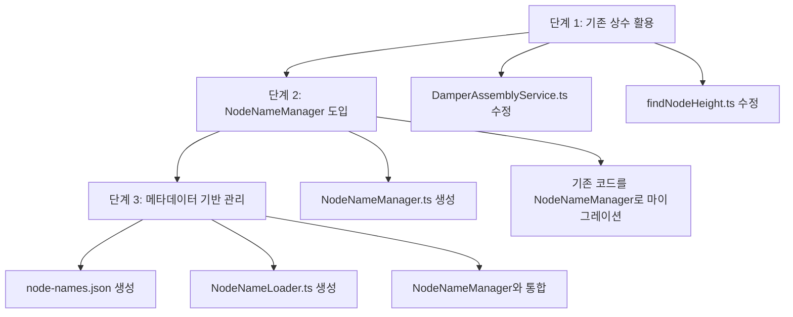

# 노드 이름 관리 아키텍처 개선 계획

## 📋 개요

프로젝트 내 하드코딩된 노드 이름을 중앙 집중식으로 관리하는 아키텍처를 개선합니다. 모델링 파일이 변경되었을 때 코드 수정 없이 메타데이터만 수정하여 노드 이름을 관리할 수 있도록 합니다.

## 🎯 목표

1. 하드코딩된 노드 이름 제거
2. 중앙 집중식 노드 이름 관리
3. 메타데이터 기반 유연한 관리
4. 유지보수성 향상

## 📊 현황 분석

### 하드코딩된 노드 이름 사용 현황

| 파일 | 라인 | 하드코딩된 노드 이름 | 우선순위 |
|------|------|-------------------|----------|
| `src/services/fridge/DamperAssemblyService.ts` | 65-66 | `ACV74674704_Damper_Assembly_13473`, `MCK71751101_Cover,Body_3117001` | 높음 |
| `src/shared/utils/findNodeHeight.ts` | 4 | `MCK71751101_Cover,Body_3117001` | 높음 |
| `src/shared/utils/SnapDetectionUtils.ts` | 186 | `SnapZoneHelper` | 보통 |

### 기존 상수 파일

`src/shared/utils/fridgeConstants.ts`에 이미 일부 상수가 정의되어 있음:

```typescript
export const LEFT_DOOR_DAMPER_COVER_BODY_NODE = "MCK71751101_Cover,Body_3117001";
export const LEFT_DOOR_DAMPER_ASSEMBLY_NODE = "ACV74674704_Damper_Assembly_13473";
export const LEFT_DOOR_SCREW1_CUSTOMIZED_NODE = "4J01424B_Screw,Customized_4168029";
export const LEFT_DOOR_SCREW2_CUSTOMIZED_NODE = "4J01424B_Screw,Customized_4168028";
```

## 🏗️ 아키텍처 설계

### 3단계 접근 방식



---

## 📁 파일 구조

```
src/
├── shared/
│   └── utils/
│       ├── NodeNameManager.ts      [신규] 노드 이름 관리자
│       ├── NodeNameLoader.ts        [신규] 메타데이터 로더
│       └── fridgeConstants.ts       [기존] 냉장고 상수 (유지)
public/
└── metadata/
    ├── assembly-offsets.json        [기존] 조립 오프셋
    └── node-names.json             [신규] 노드 이름 메타데이터
```

---

## 🚀 구현 단계

### 단계 1: 기존 상수 활용 (즉시 적용)

#### 1.1 `DamperAssemblyService.ts` 수정

**파일:** `src/services/fridge/DamperAssemblyService.ts`

**변경 사항:**
- `fridgeConstants.ts`에서 상수 import
- 하드코딩된 노드 이름을 상수로 교체

```typescript
// 상단 import 추가
import {
    LEFT_DOOR_DAMPER_ASSEMBLY_NODE,
    LEFT_DOOR_DAMPER_COVER_BODY_NODE
} from '../../shared/utils/fridgeConstants';

// debugPrintDamperStructure() 메서드 내 수정
public debugPrintDamperStructure(): void {
    if (!this.sceneRoot) {
        console.warn('[DamperAssemblyService] sceneRoot가 초기화되지 않았습니다.');
        return;
    }

    const damperAssembly = this.sceneRoot.getObjectByName(LEFT_DOOR_DAMPER_ASSEMBLY_NODE);
    const damperCover = this.sceneRoot.getObjectByName(LEFT_DOOR_DAMPER_COVER_BODY_NODE);

    console.log('=== Damper Assembly 노드 구조 ===');
    this.printNodeNames(damperAssembly);

    console.log('=== Damper Cover 노드 구조 ===');
    this.printNodeNames(damperCover);
}
```

#### 1.2 `findNodeHeight.ts` 수정

**파일:** `src/shared/utils/findNodeHeight.ts`

**변경 사항:**
- `fridgeConstants.ts`에서 상수 import
- 하드코딩된 노드 이름을 상수로 교체

```typescript
// 상단 import 추가
import { LEFT_DOOR_DAMPER_COVER_BODY_NODE } from './fridgeConstants';

// 기존 하드코딩된 상수 제거
// const HighlightNode = 'MCK71751101_Cover,Body_3117001';

// findNodeHeight() 함수 내 수정
export const findNodeHeight = (
    root: THREE.Object3D,
    camera: THREE.PerspectiveCamera,
    controls?: { target: THREE.Vector3; update: () => void },
    options?: {
        highlightNodeName?: string;
        matchMode?: 'includes' | 'equals';
        duration?: number;
        boxColor?: number;
        append?: boolean;
    }
) => {
    const highlightNodeName = options?.highlightNodeName ?? LEFT_DOOR_DAMPER_COVER_BODY_NODE;
    // ... 나머지 코드는 그대로 유지
};
```

---

### 단계 2: NodeNameManager 도입

#### 2.1 `NodeNameManager.ts` 생성

**파일:** `src/shared/utils/NodeNameManager.ts`

```typescript
/**
 * 노드 이름 관리자
 * 모든 3D 모델 노드 이름을 중앙 집중식으로 관리
 */
export class NodeNameManager {
    private static instance: NodeNameManager;
    private nodeNames: Map<string, string> = new Map();

    private constructor() {
        this.initializeNodeNames();
    }

    public static getInstance(): NodeNameManager {
        if (!NodeNameManager.instance) {
            NodeNameManager.instance = new NodeNameManager();
        }
        return NodeNameManager.instance;
    }

    private initializeNodeNames(): void {
        // 냉장고 왼쪽 도어 노드들
        this.nodeNames.set('LEFT_DOOR_DAMPER_COVER_BODY', 'MCK71751101_Cover,Body_3117001');
        this.nodeNames.set('LEFT_DOOR_DAMPER_ASSEMBLY', 'ACV74674704_Damper_Assembly_13473');
        this.nodeNames.set('LEFT_DOOR_SCREW1_CUSTOMIZED', '4J01424B_Screw,Customized_4168029');
        this.nodeNames.set('LEFT_DOOR_SCREW2_CUSTOMIZED', '4J01424B_Screw,Customized_4168028');
        
        // 헬퍼 노드들
        this.nodeNames.set('SNAP_ZONE_HELPER', 'SnapZoneHelper');
    }

    /**
     * 노드 이름 가져오기
     * @param key 노드 키
     * @returns 노드 이름 (없으면 null)
     */
    public getNodeName(key: string): string | null {
        return this.nodeNames.get(key) || null;
    }

    /**
     * 노드 이름 설정 (런타임 동적 추가)
     * @param key 노드 키
     * @param name 노드 이름
     */
    public setNodeName(key: string, name: string): void {
        this.nodeNames.set(key, name);
    }

    /**
     * 모든 노드 이름 가져오기
     * @returns 노드 이름 맵
     */
    public getAllNodeNames(): Map<string, string> {
        return new Map(this.nodeNames);
    }

    /**
     * 노드 이름 존재 여부 확인
     * @param key 노드 키
     * @returns 존재하면 true
     */
    public hasNodeName(key: string): boolean {
        return this.nodeNames.has(key);
    }

    /**
     * 노드 이름 삭제
     * @param key 노드 키
     */
    public removeNodeName(key: string): void {
        this.nodeNames.delete(key);
    }

    /**
     * 모든 노드 이름 초기화
     */
    public clear(): void {
        this.nodeNames.clear();
    }
}

// 싱글톤 인스턴스 내보내기
export const getNodeNameManager = () => NodeNameManager.getInstance();
```

#### 2.2 기존 코드를 NodeNameManager로 마이그레이션

**파일:** `src/services/fridge/DamperAssemblyService.ts`

```typescript
// import 추가
import { getNodeNameManager } from '../../shared/utils/NodeNameManager';

// debugPrintDamperStructure() 메서드 내 수정
public debugPrintDamperStructure(): void {
    if (!this.sceneRoot) {
        console.warn('[DamperAssemblyService] sceneRoot가 초기화되지 않았습니다.');
        return;
    }

    const nodeNameManager = getNodeNameManager();
    const damperAssembly = this.sceneRoot.getObjectByName(
        nodeNameManager.getNodeName('LEFT_DOOR_DAMPER_ASSEMBLY')!
    );
    const damperCover = this.sceneRoot.getObjectByName(
        nodeNameManager.getNodeName('LEFT_DOOR_DAMPER_COVER_BODY')!
    );

    console.log('=== Damper Assembly 노드 구조 ===');
    this.printNodeNames(damperAssembly);

    console.log('=== Damper Cover 노드 구조 ===');
    this.printNodeNames(damperCover);
}
```

---

### 단계 3: 메타데이터 기반 관리

#### 3.1 `node-names.json` 생성

**파일:** `public/metadata/node-names.json`

```json
{
  "fridge": {
    "leftDoor": {
      "damperCoverBody": "MCK71751101_Cover,Body_3117001",
      "damperAssembly": "ACV74674704_Damper_Assembly_13473",
      "screw1Customized": "4J01424B_Screw,Customized_4168029",
      "screw2Customized": "4J01424B_Screw,Customized_4168028"
    },
    "rightDoor": {
      "damperCoverBody": "",
      "damperAssembly": "",
      "screw1Customized": "",
      "screw2Customized": ""
    }
  },
  "helpers": {
    "snapZoneHelper": "SnapZoneHelper"
  }
}
```

#### 3.2 `NodeNameLoader.ts` 생성

**파일:** `src/shared/utils/NodeNameLoader.ts`

```typescript
/**
 * 노드 이름 로더
 * JSON 파일에서 노드 이름을 로드하여 관리
 */
export class NodeNameLoader {
    private static instance: NodeNameLoader;
    private nodeNames: any = null;
    private isLoaded: boolean = false;

    private constructor() {}

    public static getInstance(): NodeNameLoader {
        if (!NodeNameLoader.instance) {
            NodeNameLoader.instance = new NodeNameLoader();
        }
        return NodeNameLoader.instance;
    }

    /**
     * 노드 이름 메타데이터 로드
     * @param path 메타데이터 파일 경로
     */
    public async loadNodeNames(path: string = '/metadata/node-names.json'): Promise<void> {
        try {
            const response = await fetch(path);
            if (!response.ok) {
                throw new Error(`HTTP error! status: ${response.status}`);
            }
            this.nodeNames = await response.json();
            this.isLoaded = true;
            console.log('[NodeNameLoader] 노드 이름 로드 완료');
        } catch (error) {
            console.error('[NodeNameLoader] 노드 이름 로드 실패:', error);
            throw error;
        }
    }

    /**
     * 노드 이름 가져오기 (점 표기법 지원)
     * @param path 노드 경로 (예: 'fridge.leftDoor.damperCoverBody')
     * @returns 노드 이름
     */
    public getNodeName(path: string): string | null {
        if (!this.isLoaded || !this.nodeNames) {
            console.warn('[NodeNameLoader] 노드 이름이 로드되지 않았습니다.');
            return null;
        }

        const keys = path.split('.');
        let current: any = this.nodeNames;

        for (const key of keys) {
            if (current[key] === undefined) {
                console.warn(`[NodeNameLoader] 노드 경로를 찾을 수 없습니다: ${path}`);
                return null;
            }
            current = current[key];
        }

        return current as string;
    }

    /**
     * 로드 여부 확인
     */
    public isLoadedData(): boolean {
        return this.isLoaded;
    }

    /**
     * 전체 메타데이터 가져오기
     */
    public getAllMetadata(): any {
        return this.nodeNames;
    }
}

export const getNodeNameLoader = () => NodeNameLoader.getInstance();
```

#### 3.3 NodeNameManager와 NodeNameLoader 통합

**파일:** `src/shared/utils/NodeNameManager.ts` (수정)

```typescript
import { getNodeNameLoader } from './NodeNameLoader';

export class NodeNameManager {
    private static instance: NodeNameManager;
    private nodeNames: Map<string, string> = new Map();
    private useMetadata: boolean = false;

    private constructor() {
        this.initializeNodeNames();
    }

    public static getInstance(): NodeNameManager {
        if (!NodeNameManager.instance) {
            NodeNameManager.instance = new NodeNameManager();
        }
        return NodeNameManager.instance;
    }

    /**
     * 메타데이터 사용 모드 활성화
     */
    public async enableMetadataMode(): Promise<void> {
        const loader = getNodeNameLoader();
        if (!loader.isLoadedData()) {
            await loader.loadNodeNames();
        }
        this.useMetadata = true;
        console.log('[NodeNameManager] 메타데이터 모드 활성화');
    }

    /**
     * 메타데이터 사용 모드 비활성화
     */
    public disableMetadataMode(): void {
        this.useMetadata = false;
        console.log('[NodeNameManager] 메타데이터 모드 비활성화');
    }

    /**
     * 노드 이름 가져오기
     * @param key 노드 키
     * @returns 노드 이름 (없으면 null)
     */
    public getNodeName(key: string): string | null {
        // 메타데이터 모드가 활성화된 경우
        if (this.useMetadata) {
            const loader = getNodeNameLoader();
            const metadataName = loader.getNodeName(key);
            if (metadataName) {
                return metadataName;
            }
        }

        // 기본 맵에서 검색
        return this.nodeNames.get(key) || null;
    }

    // ... 나머지 메서드는 그대로 유지
}
```

---

## 📝 사용 예시

### 예시 1: 기본 사용 (NodeNameManager)

```typescript
import { getNodeNameManager } from '../../shared/utils/NodeNameManager';

const nodeNameManager = getNodeNameManager();

// 노드 이름 가져오기
const damperAssemblyName = nodeNameManager.getNodeName('LEFT_DOOR_DAMPER_ASSEMBLY');
const damperCoverName = nodeNameManager.getNodeName('LEFT_DOOR_DAMPER_COVER_BODY');

// 노드 찾기
const damperAssembly = this.sceneRoot.getObjectByName(damperAssemblyName!);
const damperCover = this.sceneRoot.getObjectByName(damperCoverName!);
```

### 예시 2: 메타데이터 모드 사용

```typescript
import { getNodeNameManager } from '../../shared/utils/NodeNameManager';

const nodeNameManager = getNodeNameManager();

// 메타데이터 모드 활성화
await nodeNameManager.enableMetadataMode();

// 점 표기법으로 노드 이름 가져오기
const damperCoverName = nodeNameManager.getNodeName('fridge.leftDoor.damperCoverBody');
```

### 예시 3: 런타임 동적 추가

```typescript
import { getNodeNameManager } from '../../shared/utils/NodeNameManager';

const nodeNameManager = getNodeNameManager();

// 런타임에 새로운 노드 이름 추가
nodeNameManager.setNodeName('NEW_NODE_KEY', 'NewNodeName_12345');

// 노드 이름 가져오기
const newNodeName = nodeNameManager.getNodeName('NEW_NODE_KEY');
```

---

## ✅ 검증 체크리스트

### 단계 1 검증
- [ ] `DamperAssemblyService.ts`에서 하드코딩된 노드 이름이 제거됨
- [ ] `findNodeHeight.ts`에서 하드코딩된 노드 이름이 제거됨
- [ ] `fridgeConstants.ts`의 상수가 정상적으로 import됨
- [ ] 기존 기능이 정상적으로 작동함

### 단계 2 검증
- [ ] `NodeNameManager.ts`가 생성됨
- [ ] `NodeNameManager` 싱글톤 패턴이 정상 작동함
- [ ] 기존 코드가 `NodeNameManager`를 사용하도록 마이그레이션됨
- [ ] 런타임 동적 추가 기능이 작동함

### 단계 3 검증
- [ ] `node-names.json`이 생성됨
- [ ] `NodeNameLoader.ts`가 생성됨
- [ ] 메타데이터 로드 기능이 작동함
- [ ] 점 표기법으로 노드 이름을 가져올 수 있음
- [ ] `NodeNameManager`와 `NodeNameLoader`가 통합됨
- [ ] 메타데이터 모드 전환이 작동함

---

## 🔄 마이그레이션 가이드

### 기존 코드 마이그레이션 단계

1. **기존 상수 사용 코드 유지** (단계 1)
   - `fridgeConstants.ts`의 상수를 그대로 사용
   - 하드코딩된 부분만 상수로 교체

2. **NodeNameManager로 점진적 마이그레이션** (단계 2)
   - 새로운 코드는 `NodeNameManager` 사용
   - 기존 코드는 점진적으로 마이그레이션

3. **메타데이터 모드로 전환** (단계 3)
   - `node-names.json`에 모든 노드 이름 등록
   - `enableMetadataMode()` 호출하여 메타데이터 모드 활성화

---

## 📌 주의사항

1. **하위 호환성 유지**
   - `fridgeConstants.ts`의 상수는 그대로 유지
   - 기존 코드가 정상 작동하도록 보장

2. **메타데이터 로드 타이밍**
   - 메타데이터 모드 사용 전 반드시 `loadNodeNames()` 호출
   - 애플리케이션 초기화 시 로드 권장

3. **에러 처리**
   - 노드 이름을 찾을 수 없는 경우 null 반환
   - 적절한 로그 출력으로 디버깅 지원

4. **성능 고려**
   - `NodeNameManager`는 싱글톤 패턴으로 인스턴스 재사용
   - 메타데이터는 한 번만 로드하여 캐싱

---

## 🎯 예상 효과

1. **유지보수성 향상**
   - 노드 이름 변경 시 JSON 파일만 수정
   - 코드 수정 불필요

2. **확장성 확보**
   - 새로운 노드 이름 쉽게 추가
   - 런타임 동적 추가 가능

3. **일관성 보장**
   - 중앙 집중식 관리로 일관된 노드 이름 사용
   - 오타 감소

4. **테스트 용이성**
   - 노드 이름을 쉽게 모킹 가능
   - 단위 테스트 작성 용이
