# 슬롯 삽입 조립 애니메이션 구현 계획

## 📋 요구사항 분석

### 목표
- **왼쪽 돌출부** (`LEFT_DOOR_DAMPER_COVER_BODY_NODE`)를 **오른쪽 홈** (`LEFT_DOOR_DAMPER_ASSEMBLY_NODE`)에 삽입하는 조립 애니메이션 구현
- X, Y 축만 사용한 선형 이동 (Z축 고정)
- 부드러운 애니메이션과 정확한 위치 정렬

### 현재 상태
- [`PartAssemblyService.ts`](../src/services/fridge/PartAssemblyService.ts)에 이미 X, Y 축 기반 선형 이동 로직이 구현되어 있음
- [`animateLinearAssembly()`](../src/services/fridge/PartAssemblyService.ts:33): 기본 선형 조립 함수 (line 86-88에서 x, y만 애니메이션)
- [`assemblePart()`](../src/services/fridge/PartAssemblyService.ts:166): 고급 조립 함수 (line 232-234에서 x, y만 애니메이션)

---

## 🎯 구현 전략

### 1. 현재 코드 분석 결과

#### ✅ 이미 구현된 기능
```typescript
// animateLinearAssembly() - Line 86-88
this.timeline.to(sourceNode.position, {
    x: targetLocalPos.x,
    y: targetLocalPos.y,  // Z축 제외 - 이미 요구사항 충족
    duration: config.duration / 1000,
    ease: config.easing
});
```

#### ✅ 좌표 변환 시스템
- [`CoordinateTransformUtils.getWorldCenter()`](../src/shared/utils/CoordinateTransformUtils.ts:64): 타겟 노드의 정확한 월드 중심점 계산
- [`CoordinateTransformUtils.worldToLocal()`](../src/shared/utils/CoordinateTransformUtils.ts:19): 월드 좌표를 부모 기준 로컬 좌표로 변환
- [`getPreciseBoundingBox()`](../src/shared/utils/CoordinateTransformUtils.ts:107): 모든 자식 메쉬를 순회하여 정밀한 바운딩 박스 계산

---

## 🔧 필요한 수정 사항

### 문제점 진단

현재 코드는 **타겟 노드의 중심점**으로 이동하도록 설계되어 있습니다. 하지만 **슬롯 삽입** 시나리오에서는:

1. **홈(슬롯)의 중심**이 아닌 **홈의 입구 위치**로 이동해야 함
2. **돌출부의 끝단**이 **홈의 입구**와 정렬되어야 함
3. Z축은 고정하되, **삽입 방향(X 또는 Y)**을 명확히 정의해야 함

### 해결 방안

#### Option 1: 오프셋 기반 조립 (권장)
타겟 중심점에서 특정 방향으로 오프셋을 적용하여 홈 입구 위치 계산

```typescript
// 예시: 홈이 X축 방향으로 열려있다면
const slotEntrance = targetLocalPos.clone();
slotEntrance.x += slotDepth / 2; // 홈 깊이의 절반만큼 X축 이동
```

#### Option 2: 별도의 타겟 마커 노드 사용
3D 모델에 "삽입 목표 지점" 마커 노드를 추가하고 해당 위치로 이동

---

## 📦 수정할 파일 목록

### 1. **필수 수정 파일**

#### [`src/services/fridge/PartAssemblyService.ts`](../src/services/fridge/PartAssemblyService.ts)
**수정 내용:**
- `animateLinearAssembly()` 함수에 **슬롯 오프셋 옵션** 추가
- `AssemblyOptions` 인터페이스에 `slotOffset?: THREE.Vector3` 필드 추가
- 타겟 위치 계산 시 오프셋 적용 로직 추가

**수정 위치:**
- Line 10-17: `AssemblyOptions` 인터페이스
- Line 65-71: 타겟 위치 계산 로직

#### [`src/services/fridge/ManualAssemblyManager.ts`](../src/services/fridge/ManualAssemblyManager.ts)
**수정 내용:**
- `prepareManualAssembly()` 호출 시 슬롯 오프셋 전달
- 냉장고 도어 댐퍼 커버의 삽입 방향 정의

**수정 위치:**
- Line 46-62: `animateLinearAssembly()` 호출 부분

### 2. **선택적 수정 파일**

#### [`src/shared/utils/fridgeConstants.ts`](../src/shared/utils/fridgeConstants.ts)
**추가 내용:**
- 슬롯 삽입 방향 상수 정의
- 부품별 오프셋 값 정의

```typescript
// 예시
export const DAMPER_COVER_SLOT_OFFSET = new THREE.Vector3(0.05, 0, 0);
export const SLOT_INSERTION_DIRECTION = 'X_AXIS'; // 또는 'Y_AXIS'
```

---

## 🛠️ 사용 가능한 라이브러리 및 유틸리티

### 이미 프로젝트에 통합된 라이브러리

#### 1. **GSAP (GreenSock Animation Platform)** ✅
- **용도**: 부드러운 애니메이션 타임라인 제어
- **현재 사용 중**: [`PartAssemblyService.ts`](../src/services/fridge/PartAssemblyService.ts:2)에서 import
- **장점**:
  - 정밀한 이징(easing) 제어 (`power2.inOut`, `power3.inOut` 등)
  - 타임라인 일시정지/재개/되돌리기 지원
  - 프레임 단위 진행률 추적

#### 2. **Three.js 좌표 변환 시스템** ✅
- **구현 위치**: [`CoordinateTransformUtils.ts`](../src/shared/utils/CoordinateTransformUtils.ts)
- **제공 기능**:
  - 월드 ↔ 로컬 좌표 변환
  - 정밀 바운딩 박스 계산
  - 객체 간 거리 측정

#### 3. **스냅 감지 시스템** ✅
- **구현 위치**: [`SnapDetectionUtils.ts`](../src/shared/utils/SnapDetectionUtils.ts)
- **제공 기능**:
  - 스냅 존 진입 감지 (line 42-48)
  - 거리 기반 스냅 강도 계산 (line 62-68)
  - 자석 효과 애니메이션 (line 84-107)
- **활용 방안**: 돌출부가 홈에 가까워지면 자동으로 끌어당기는 효과 구현 가능

### 추가 고려 라이브러리 (선택사항)

#### 1. **Cannon.js / Rapier** (물리 엔진)
- **용도**: 충돌 감지 및 물리 기반 삽입 시뮬레이션
- **필요성**: ❌ 현재 요구사항(단순 선형 이동)에는 과도함
- **권장**: 향후 복잡한 조립 시나리오에서만 고려

#### 2. **Tween.js**
- **필요성**: ❌ GSAP가 이미 통합되어 있어 불필요

---

## 📐 구현 세부 사항

### 1. 슬롯 오프셋 계산 방법

```typescript
/**
 * 슬롯 삽입을 위한 타겟 위치 계산
 * @param targetNode 홈(슬롯) 노드
 * @param insertionAxis 삽입 방향 ('x' | 'y')
 * @param offset 오프셋 거리
 */
function calculateSlotEntrance(
    targetNode: THREE.Object3D,
    insertionAxis: 'x' | 'y',
    offset: number
): THREE.Vector3 {
    const targetCenter = CoordinateTransformUtils.getWorldCenter(targetNode);
    const slotSize = CoordinateTransformUtils.getBoundingBoxSize(targetNode);
    
    // 홈의 입구 위치 = 중심 + (크기/2) * 삽입 방향
    if (insertionAxis === 'x') {
        targetCenter.x += slotSize.x / 2 + offset;
    } else {
        targetCenter.y += slotSize.y / 2 + offset;
    }
    
    return targetCenter;
}
```

### 2. 애니메이션 단계 설계

```mermaid
graph LR
    A[시작 위치] -->|1단계: 접근| B[홈 입구]
    B -->|2단계: 삽입| C[홈 중심]
    C -->|3단계: 스냅| D[최종 위치]
    
    style A fill:#e1f5ff
    style B fill:#fff4e1
    style C fill:#ffe1f5
    style D fill:#e1ffe1
```



**단계별 설명:**
1. **접근 단계**: 돌출부를 홈 입구 앞까지 이동 (빠른 이동, `power2.in`)
2. **삽입 단계**: 홈 안으로 천천히 삽입 (선형 이동, `linear`)
3. **스냅 단계**: 최종 위치에 자석처럼 끌어당김 (짧고 강한 이동, `back.out`)

### 3. 이징(Easing) 효과 권장사항

| 단계 | GSAP Easing | 효과 | 지속시간 |
|------|-------------|------|----------|
| 접근 | `power2.in` | 점점 빨라짐 | 1000ms |
| 삽입 | `linear` | 일정한 속도 | 800ms |
| 스냅 | `back.out(2)` | 오버슈트 후 안착 | 300ms |

---

## 🎬 사용 예시

### 기본 사용법 (수정 후)

```typescript
import { getManualAssemblyManager } from './services/fridge/ManualAssemblyManager';

const manager = getManualAssemblyManager();
manager.initialize(sceneRoot);

// 슬롯 삽입 애니메이션 실행
await manager.prepareManualAssembly({
    duration: 2000,
    slotOffset: new THREE.Vector3(0.05, 0, 0), // X축 방향 5cm 오프셋
    onProgress: (progress) => {
        console.log(`조립 진행률: ${(progress * 100).toFixed(1)}%`);
    },
    onComplete: () => {
        console.log('슬롯 삽입 완료!');
    }
});
```

### 고급 사용법 (스냅 효과 포함)

```typescript
import { PartAssemblyService } from './services/fridge/PartAssemblyService';
import { SnapDetectionUtils } from './shared/utils/SnapDetectionUtils';

const assemblyService = new PartAssemblyService(sceneRoot);

await assemblyService.animateLinearAssembly(
    'LEFT_DOOR_DAMPER_COVER_BODY_NODE',
    'LEFT_DOOR_DAMPER_ASSEMBLY_NODE',
    {
        duration: 1500,
        easing: 'power2.inOut',
        slotOffset: new THREE.Vector3(0.05, 0, 0),
        onProgress: (progress) => {
            // 90% 지점에서 스냅 효과 트리거
            if (progress > 0.9) {
                const sourceNode = sceneRoot.getObjectByName('LEFT_DOOR_DAMPER_COVER_BODY_NODE');
                const targetNode = sceneRoot.getObjectByName('LEFT_DOOR_DAMPER_ASSEMBLY_NODE');
                
                if (SnapDetectionUtils.isInSnapZone(
                    sourceNode.position,
                    targetNode.position,
                    0.1
                )) {
                    console.log('스냅 존 진입!');
                }
            }
        }
    }
);
```

---

## ⚠️ 주의사항 및 고려사항

### 1. Z축 고정 보장
- 현재 코드는 이미 Z축을 애니메이션에서 제외하고 있음 (line 86-88, 232-234)
- **검증 필요**: 부모 노드의 변환(transform)이 Z축에 영향을 주지 않는지 확인

### 2. 좌표계 일관성
- 월드 좌표 → 로컬 좌표 변환 시 부모 노드의 회전/스케일 고려됨
- **권장**: 조립 전 `updateMatrixWorld(true)` 호출로 최신 상태 보장

### 3. 바운딩 박스 정확도
- [`getPreciseBoundingBox()`](../src/shared/utils/CoordinateTransformUtils.ts:107)는 모든 자식 메쉬를 순회
- **성능**: 복잡한 모델의 경우 초기화 시 한 번만 계산하고 캐싱 권장

### 4. 애니메이션 충돌 방지
- 이미 애니메이션 중일 때 새 애니메이션 시작 방지
- [`isPlaying()`](../src/services/fridge/PartAssemblyService.ts:383) 메서드로 상태 확인

---

## 🔍 디버깅 도구

### 1. 스냅 존 시각화
```typescript
import { SnapDetectionUtils } from './shared/utils/SnapDetectionUtils';

// 홈 위치에 반투명 구체 표시
const helper = SnapDetectionUtils.visualizeSnapZone(
    scene,
    targetPosition,
    0.15,  // 반경 15cm
    0x00ff00  // 녹색
);

// 디버깅 완료 후 제거
SnapDetectionUtils.removeSnapZoneHelper(scene);
```

### 2. 좌표 로깅
```typescript
console.log('[Debug] 소스 월드 위치:', sourceNode.getWorldPosition(new THREE.Vector3()));
console.log('[Debug] 타겟 월드 위치:', targetNode.getWorldPosition(new THREE.Vector3()));
console.log('[Debug] 변환된 로컬 위치:', targetLocalPos);
```

---

## 📊 성능 최적화

### 1. 바운딩 박스 캐싱
```typescript
private boundingBoxCache: Map<string, THREE.Box3> = new Map();

getBoundingBoxCached(nodeName: string): THREE.Box3 {
    if (!this.boundingBoxCache.has(nodeName)) {
        const node = this.sceneRoot.getObjectByName(nodeName);
        const bbox = getPreciseBoundingBox(node);
        this.boundingBoxCache.set(nodeName, bbox);
    }
    return this.boundingBoxCache.get(nodeName)!;
}
```

### 2. 애니메이션 최적화
- GSAP의 `lazy: false` 옵션으로 첫 프레임 지연 방지
- `force3D: true`로 GPU 가속 활성화 (하드웨어 지원 시)

---

## 🎯 다음 단계

1. **코드 수정 실행**: Code 모드로 전환하여 실제 구현
2. **테스트**: 다양한 각도와 거리에서 조립 동작 검증
3. **미세 조정**: 오프셋 값과 이징 효과 최적화
4. **문서화**: 최종 구현 내용을 프로젝트 문서에 반영

---

## 📚 참고 자료

- [GSAP Easing Visualizer](https://gsap.com/docs/v3/Eases)
- [Three.js 좌표계 문서](https://threejs.org/docs/#manual/en/introduction/Matrix-transformations)
- 프로젝트 내부 문서: [`DAMPER_ASSEMBLY_GUIDE.md`](../docs/DAMPER_ASSEMBLY_GUIDE.md)
